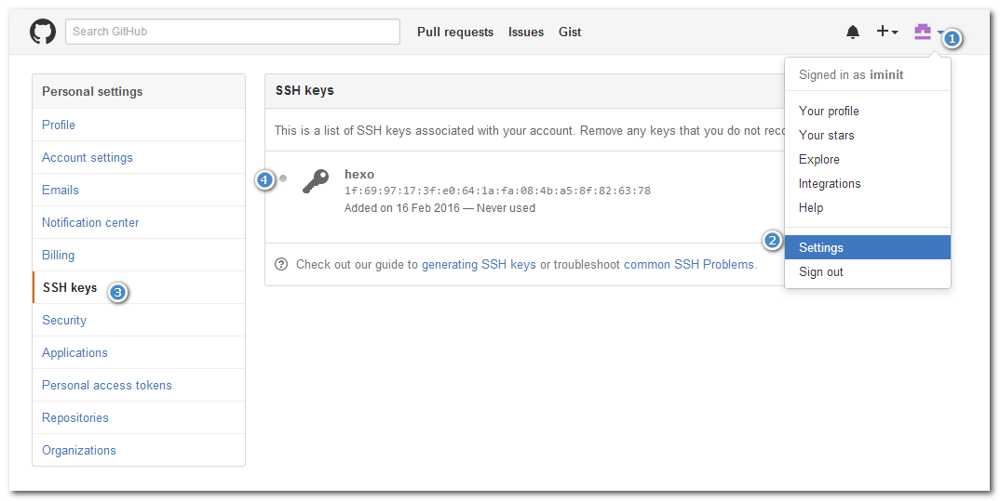

## 验证报错报错verification failed：

Error: Host key verification failed.
fatal: Could not read from remote repository.
Please make sure you have the correct access rights and the repository exists.

解决方法：条件SSHkey
$ ssh-keygen -t rsa -C "imsofter@163.com"
三次回车，即可设置密码为空

将生成的C:\Users\Administrator.ssh目录下的id_rsa.pub添加到github上

再测试是否可以连接到github上，
$ ssh git@github.com
Hi imsofter! You've successfully authenticated, but GitHub does not provide shell access.
Connection to github.com closed.

再可以将代码推上github上了。

